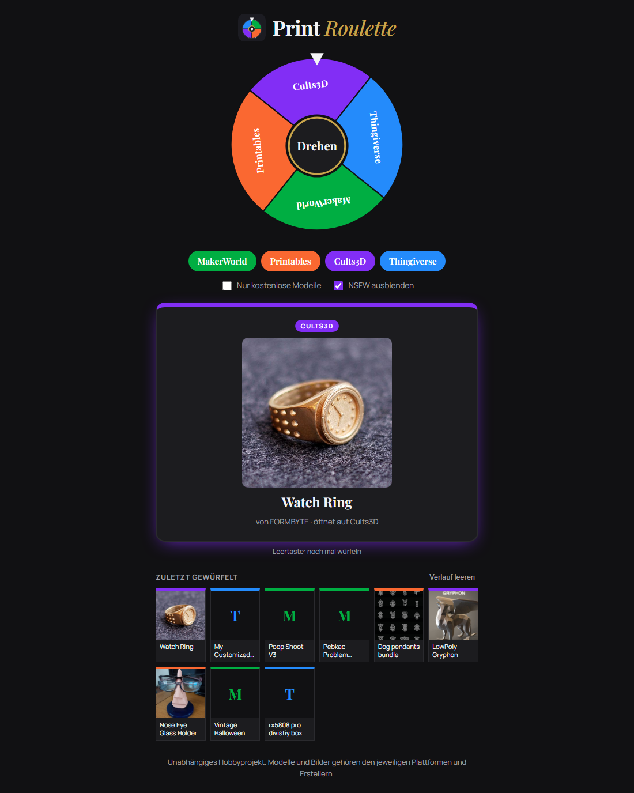
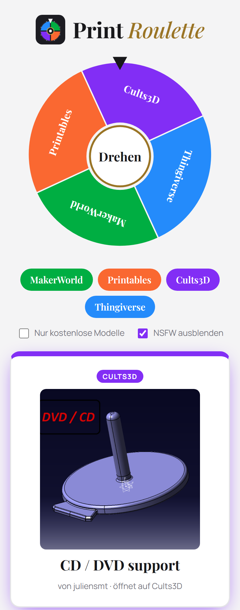

## Hi, I'm Schnuecks 👋

3D printing enthusiast and homelab tinkerer from Germany. I build small self-hosted tools
for my own setup and share them when they might be useful to others too.

- 🖨️ **3D printing** on a Bambu Lab P2S and a Prusa Mini+
- 🏠 **Homelab & self-hosting**: my own services at home, running in Docker
- 🐍 Mostly **Python**, with a bit of Shell
- 🌐 All my projects at a glance: **[schnuecks.dev](https://schnuecks.dev)**

If my projects are useful to you, you can buy me a coffee ☕ on Ko-fi

  

---

###  [PlateShelf](https://github.com/Schnuecks/plateshelf) 

**A self-hosted archive for your 3D prints.** PlateShelf reads sliced files from Bambu Studio,
OrcaSlicer, PrusaSlicer, Cura and others and shows them as clearly as your slicer does:
plates with previews, print time, filament, costs and a 3D preview of the actual toolpaths.

- Direct import from **Bambu Lab**, **Prusa** (PrusaLink) and **Klipper** printers (Moonraker)
- **Print history** with statistics, notes per print and your own photos of the result
- User accounts with roles, daily backups, six languages, light and dark theme
- Runs as a single Docker container on a PC, NAS or Raspberry Pi

  
  

---

###  [RDAPI](https://github.com/Schnuecks/rdapi) 

**A lean self-hosted API server for the RustDesk app.** RDAPI adds what a household or a
small team needs on top of your own ID and relay server: signing in to the app, an address
book that follows you to every device, a device list and a history of incoming connections.

- **Address book** per user with tags, synchronised between all your devices
- **Device list** with online status and a **connection history**: who connected when and for how long
- Two-factor sign-in, **passkeys** and **single sign-on** via OpenID Connect
- Web interface in six languages, daily backups, one container with one SQLite file

Public beta: everything works, but a signed-in app can only connect once RustDesk releases
its ID server fix. More at [rdapi.app](https://rdapi.app).

  
  

---

###  [Print Roulette](https://github.com/Schnuecks/print-roulette)

**Spin the wheel and discover a random 3D print.** Print Roulette picks a model from
MakerWorld, Printables, Cults3D or Thingiverse and links straight to its page, for the
evenings when you want to print something but don't know what.

- **Prize wheel** in the platform colours: spin for a random platform or roll on one directly
- **Preview image, title and creator**, filters for free models and for hiding NSFW content
- **No database, no login, no tracking**, six languages, light and dark mode
- A small container with no dependencies beyond the Python standard library

  
  

---

###  [traefik-pihole-sync](https://github.com/Schnuecks/traefik-pihole-sync)

**Traefik hostnames as local DNS records in Pi-hole v6.** Start a container with a `Host()`
rule and its name resolves on your network a minute later; remove it and the record goes
away again.

- **A, AAAA or CNAME records**, for one or several Pi-holes at once
- **Safe by design:** only deletes records it created itself, delayed deletion, dry-run mode
- Domain filter, quiet logs and a small non-root container for amd64 and arm64

---

<b>🇩🇪 Auf Deutsch</b>

 

**Hallo, ich bin Schnuecks!** 3D-Druck-Fan und Homelab-Bastler aus Deutschland. Ich baue
kleine selbstgehostete Werkzeuge für mein eigenes Setup und teile sie, wenn sie auch anderen
helfen können.

- 🖨️ **3D-Druck** mit einem Bambu Lab P2S und einem Prusa Mini+
- 🏠 **Homelab & Self-Hosting**: eigene Dienste zuhause, in Docker
- 🐍 Meistens **Python**, dazu etwas Shell
- 🌐 Alle Projekte auf einen Blick: **[schnuecks.dev/de](https://schnuecks.dev/de/)**

Wenn dir meine Projekte helfen, kannst du mir gern auf Ko-fi einen Kaffee ausgeben ☕ – über den Knopf oben.

**[PlateShelf](https://github.com/Schnuecks/plateshelf)** *(demnächst)* ist ein selbstgehostetes Archiv für
deine 3D-Drucke: Platten mit Vorschaubildern, Druckzeit, Filament, Kosten und eine 3D-Vorschau
der Druckbahnen, dazu Direktimport von Bambu-, Prusa- und Klipper-Druckern, Druckverlauf mit
Statistik, Fotos vom fertigen Druck und sechs Sprachen – in einem einzigen Docker-Container.

**[RDAPI](https://github.com/Schnuecks/rdapi)** *(öffentliche Beta)* ist ein schlanker, selbstgehosteter API-Server
für die RustDesk-App: Anmeldung in der App, ein Adressbuch, das dir auf jedes Gerät folgt,
eine Geräteliste und ein Verlauf eingehender Verbindungen, dazu Zwei-Faktor-Anmeldung,
Passkeys, Single Sign-on und eine Weboberfläche in sechs Sprachen – ein Container, eine
SQLite-Datei.

**[Print Roulette](https://github.com/Schnuecks/print-roulette)** wählt per Glücksrad einen
zufälligen 3D-Druck von MakerWorld, Printables, Cults3D oder Thingiverse und verlinkt direkt
auf dessen Seite – für die Abende, an denen du etwas drucken willst, aber nicht weißt, was.
Mit Vorschaubild, Filtern für kostenlose Modelle und gegen NSFW-Inhalte, sechs Sprachen und
ganz ohne Datenbank, Anmeldung oder Tracking.

**[traefik-pihole-sync](https://github.com/Schnuecks/traefik-pihole-sync)** trägt die
Hostnamen deiner Traefik-Router automatisch als lokale DNS-Einträge in Pi-hole v6 ein: als
A-, AAAA- oder CNAME-Eintrag, für einen oder mehrere Pi-holes. Es löscht nur Einträge, die es
selbst angelegt hat, und hat einen Probelauf-Modus.

